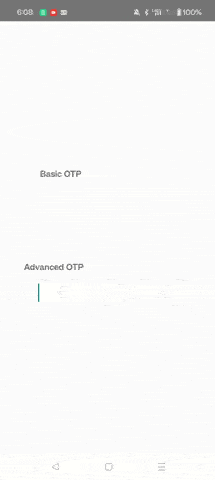

# React Native OTP
`@mustapha-ghlissi/react-native-otp`: a One Time Password Input Component for React Native.

[](https://choosealicense.com/licenses/mit/)
[](https://www.npmjs.com/package/@mustapha-ghlissi/react-native-otp)
[](https://www.npmjs.com/package/@mustapha-ghlissi/react-native-otp)

## Demo


## Installation
Use `npm` or `yarn` to install the package.

##### Using `npm`

```bash
npm i @mustapha-ghlissi/react-native-otp
```
##### Using `yarn`

```bash
yarn add @mustapha-ghlissi/react-native-otp
```

## Usage

``` js
import Otp from '@mustapha-ghlissi/react-native-otp';

<Otp onConfirm={code => console.log(code)}/>

``` 

## Props

| Parameter | Type     | Description                |
| :-------- | :------- | :------------------------- |
| length | `number`: optional | Number of OTP digits (default = `4`) |
| fillBorderColor | `string`: optional | Border color when the OTP is fully filled and it's used as the shadow color  is `enabledFillShadow` is set to `true` |
| enabledFillShadow | `boolean`: optional | Show success shadow when the OTP is fully filled |
| cursorColor | `string`: optional | InputText cursor color |
| selectionColor | `string`: optional | InputText content selection color |
| inputStyle | [TextStyle](https://reactnative.dev/docs/text-style-props), [ViewStyle Props](https://reactnative.dev/docs/view-style-props): optional | InputText custom style |
| onConfirm | `callback`: required | When the OTP is filled, then you can do whatever you need with the entered code. |


## Authors

- [@mustapha-ghlissi](https://www.github.com/mustapha-ghlissi)

