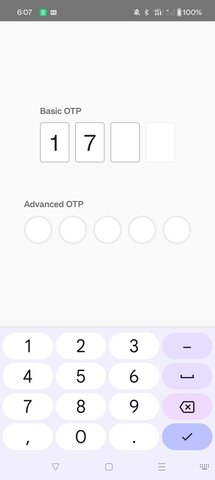

# React Native OTP
`@mustapha-ghlissi/react-native-otp`: One Time Password Input Component for React Native.

[](https://choosealicense.com/licenses/mit/)
[](https://www.npmjs.com/package/@mustapha-ghlissi/react-native-otp)
[](https://www.npmjs.com/package/@mustapha-ghlissi/react-native-otp)
[](https://www.npmjs.com/package/@mustapha-ghlissi/react-native-otp)
[](https://www.npmjs.com/package/@mustapha-ghlissi/react-native-otp)
[](https://www.npmjs.com/package/@mustapha-ghlissi/react-native-otp)
[](https://www.npmjs.com/package/@mustapha-ghlissi/react-native-otp)
[](https://www.npmjs.com/package/@mustapha-ghlissi/react-native-otp)
[](https://www.npmjs.com/package/@mustapha-ghlissi/react-native-otp)

## Screenshots




## Demo


## Installation
Use `npm` or `yarn` to install the package.

##### Using `npm`
```bash
npm i @mustapha-ghlissi/react-native-otp
```

##### Using `yarn`
```bash
yarn add @mustapha-ghlissi/react-native-otp
```

## Usage
``` tsx

    import Otp from '@mustapha-ghlissi/react-native-otp';

    <Otp onConfirm={code => console.log(code)}/>

``` 

## Props

| Parameter | Type     | Description                |
| :-------- | :------- | :------------------------- |
| length | `number`: optional | Number of OTP digits (default = `4`) |
| filledOtpColor | `string`: optional | Border color when the OTP is fully filled and it's used as the shadow color  if `enabledFillShadow` is set to `true` |
| enabledFillShadow | `boolean`: optional | Show success shadow when the OTP is fully filled |
| cursorColor | `string`: optional | InputText cursor color |
| selectionColor | `string`: optional | InputText content selection color |
| filledColor | `string`: optional | InputText border color when it's filled |
| outlineColor | `string`: optional | InputText border color when it's focused |
| inputStyle | [TextStyle](https://reactnative.dev/docs/text-style-props), [ViewStyle Props](https://reactnative.dev/docs/view-style-props): optional | InputText custom style |
| onConfirm | `callback`: required | When the OTP is filled, then you can do whatever you need with the entered code. |


## Donate
<p>Please contribute or donate so we can spend more time on this library.</p>

[Donate with Wise by clicking this link](https://wise.com/pay/me/mustaphag6) or by scanning the QRCode
<br />


## Authors
- [@mustapha-ghlissi](https://www.linkedin.com/in/mustapha-ghlissi)

## Other libraries
- [react-native-accordion](https://github.com/mustapha-ghlissi/react-native-accordion): Reanimated collapsible sections for React Native.
- [react-native-select-picker](https://github.com/mustapha-ghlissi/react-native-select-picker): Reanimated dropdown select for React Native.

